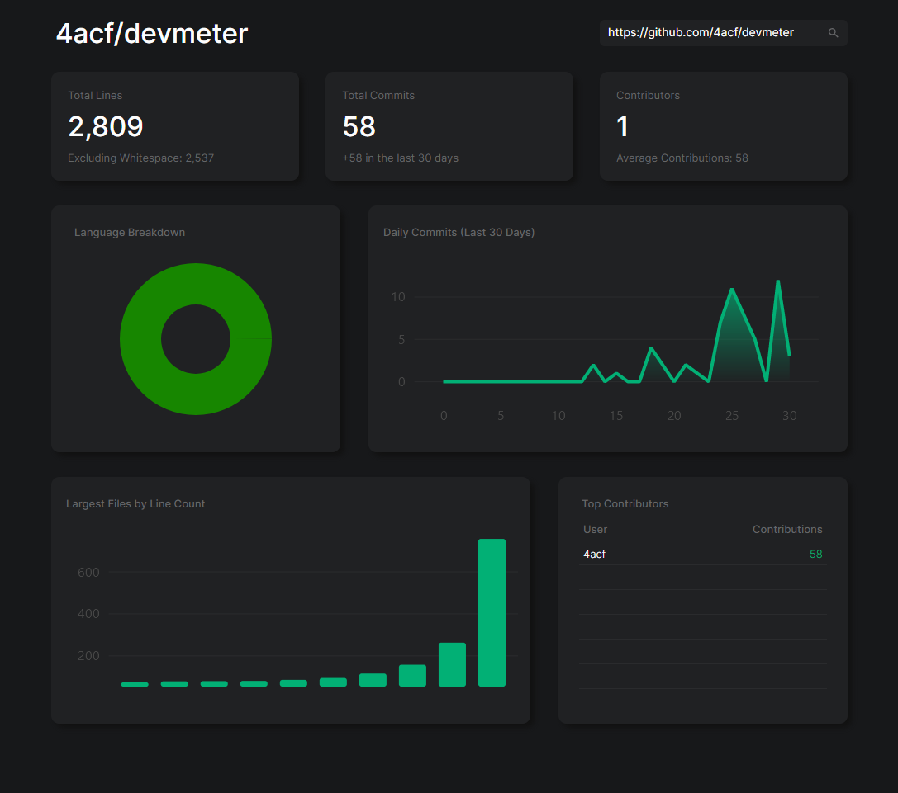

# devmeter

simple analytics tool for github repos, made more as a tiny practice project 

# Development Setup
- Clone the repo and open devmeter.sln in Visual Studio
- Run `dotnet user-secrets init` and `dotnet user-secrets set "PAT" "[your GitHub personal access token]"` (I recommend making a new GitHub personal access token with only read permissions)

> [!WARNING]
> Using a personal access token is recommended since it allows you to make 5,000 requests to GitHub's API instead of 50 which is necessary for repos that aren't tiny + making multiple searches.
> The app only interacts with the GitHub API, but of course exercise caution when handling tokens. 
